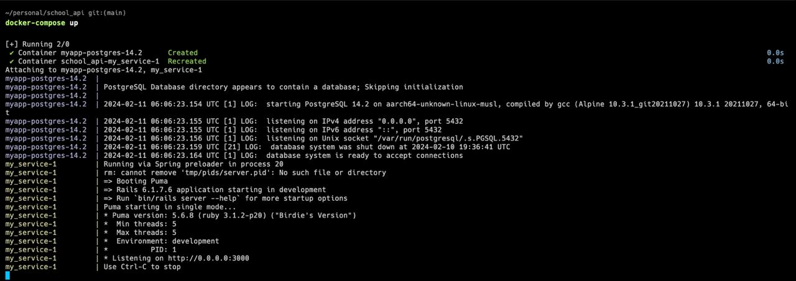
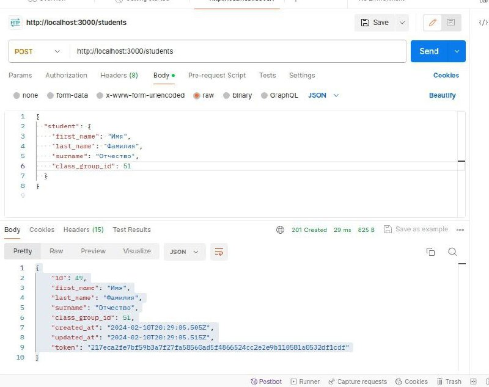
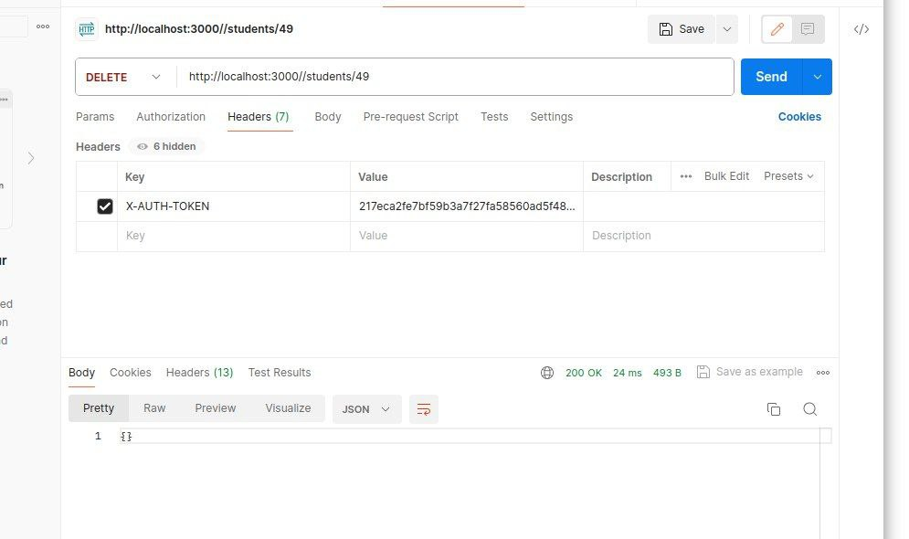
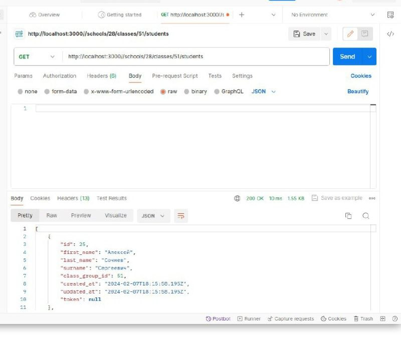
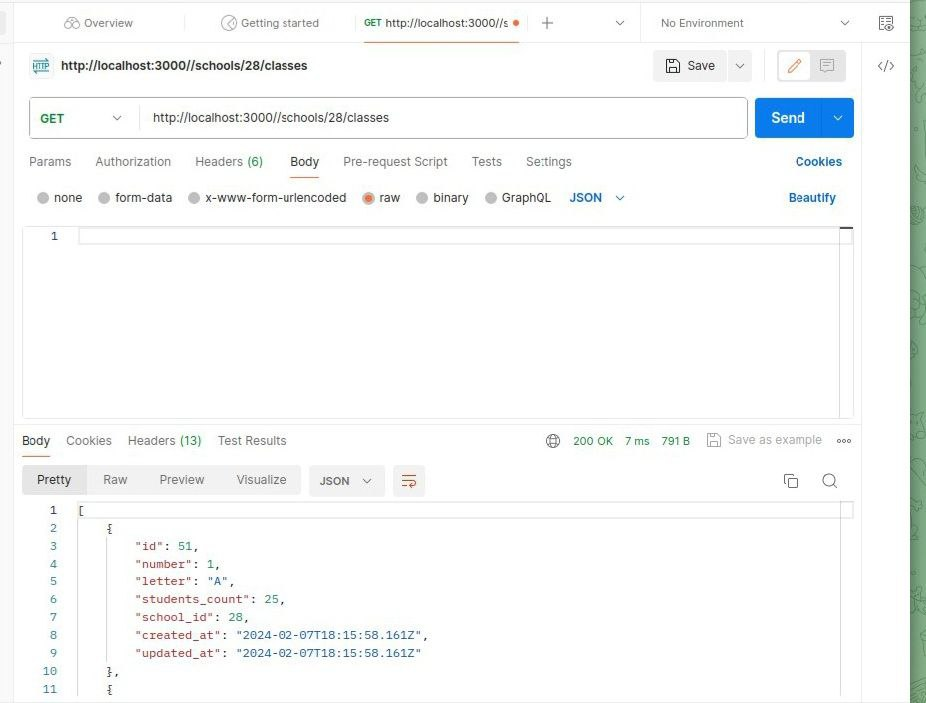

# README

# school_api

# API сервис для тестового задания

Этот проект представляет собой реализацию API сервиса в соответствии с требованиями тестового задания для стажировки в команде Учи.ру. Сервис предоставляет возможность регистрации студентов, удаления студентов и получения списка студентов класса.

## Технологии

- **Ruby on Rails:** Фреймворк для веб-разработки на языке Ruby.
- **PostgreSQL:** Реляционная база данных.
- **Docker:** Платформа для разработки, доставки и запуска приложений в контейнерах.

## Запуск проекта

Для локального запуска проекта необходимо выполнить следующие шаги:

1. Установить Docker и Docker Compose, если они еще не установлены.
2. Склонировать репозиторий:

    - Для протокола SSH:

    ```bash
    git clone git@github.com:sochnevl/school_api.git
    ```

    - Для HTTPS:

    ```bash
    git clone https://github.com/sochnevl/school_api.git
    ```

3. Перейти в директорию проекта:
	```bash
	cd school_api
	```
4.Запустить проект с помощью Docker Compose:
	```bash
	docker-compose up
	```

### Результаты запуска

Ниже приведен скриншот с результатами:

- 

После успешного запуска проекта, API будет доступно по адресу http://localhost:3000/

## Тестирование API с помощью Postman

Для тестирования API использовался инструмент Postman. В ходе тестирования были отправлены различные HTTP-запросы для проверки функциональности API.

### Примеры запросов

1. **POST /students** - Запрос на регистрацию нового студента.
2. **DELETE  /students/{user_id}** - Запрос на удаление студента по его идентификатору.
3. **GET /schools/{school_id}/classes/{class_id}/students** - Запрос для получения списка всех студентов класса.
4. **GET /schools/{school_id}/classes** - Запрос для получения списка всех классов школы.

### Результаты тестирования

Ниже приведены скриншоты с результатами тестирования:

- 
- 
- 
- 

## Обратная связь

Если у вас есть вопросы или предложения по улучшению проекта, пожалуйста, свяжитесь со мной по электронной почте: alexiamxsmart@gmail.com.